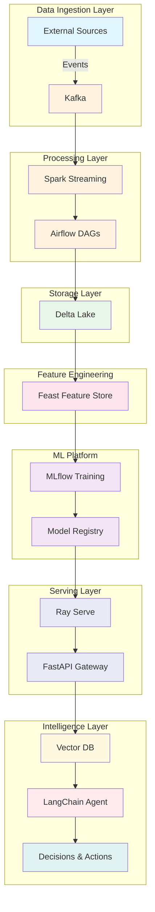

# Autonomous Enterprise AI Decision System

[](https://github.com/your-org/enterprise-ai-decision-system/actions/workflows/ci.yml)
[](https://opensource.org/licenses/MIT)
[](https://www.python.org/downloads/)

An enterprise-grade autonomous AI decision system that combines real-time data streaming, advanced ML pipelines, and intelligent agents for automated decision-making at scale.

## 🎯 Purpose

This system enables organizations to:

- **Ingest** real-time data streams from multiple sources via Kafka
- **Process** and transform data with Spark and Airflow orchestration
- **Store** data in a Delta Lake with ACID guarantees
- **Engineer** and serve features using Feast feature store
- **Train** and track ML models with MLflow
- **Serve** models at scale with FastAPI and Ray Serve
- **Augment** decisions with vector similarity search
- **Orchestrate** autonomous agents via LangChain for complex reasoning

## 🏗️ High-Level Architecture



## 📁 Repository Structure

```
.
├── services/
│   ├── data-ingestion/      # Kafka producers and consumers
│   ├── data-processing/     # Spark jobs and Airflow DAGs
│   ├── data-lake/           # Delta Lake configurations
│   ├── feature-store/       # Feast feature definitions
│   ├── ml-platform/         # MLflow experiments and training
│   ├── serving/             # FastAPI and Ray Serve endpoints
│   ├── vector-db/           # Vector database integrations
│   └── agent/               # LangChain agent orchestration
├── infra/
│   └── terraform/           # Infrastructure as Code
├── deploy/
│   └── k8s/                 # Kubernetes manifests
├── docs/
│   └── ARCHITECTURE.md      # Detailed architecture documentation
├── tests/                   # Integration and e2e tests
└── .github/
    ├── workflows/           # CI/CD pipelines
    └── ISSUE_TEMPLATE/      # Issue templates
```

## 🚀 Quick Start

### Prerequisites

- Python 3.11+
- Docker & Docker Compose
- Poetry (dependency management)

### Setup Development Environment

```bash
# Clone the repository
git clone https://github.com/your-org/enterprise-ai-decision-system.git
cd enterprise-ai-decision-system

# Initialize git (if starting fresh)
git init

# Install Poetry (if not installed)
curl -sSL https://install.python-poetry.org | python3 -

# Install dependencies
poetry install

# Install pre-commit hooks
poetry run pre-commit install

# Run linting
poetry run ruff check .
poetry run mypy .

# Run tests
poetry run pytest
```

### Running Services Locally

```bash
# Start infrastructure (Kafka, databases, etc.)
docker-compose up -d

# Run specific service
cd services/<service-name>
poetry run python main.py
```

## 🛠️ Technology Stack

| Layer | Technology | Purpose |
|-------|------------|---------|
| Ingestion | Apache Kafka | Real-time event streaming |
| Processing | Apache Spark | Distributed data processing |
| Orchestration | Apache Airflow | Workflow orchestration |
| Storage | Delta Lake | ACID-compliant data lake |
| Features | Feast | Feature store and serving |
| ML Platform | MLflow | Experiment tracking, model registry |
| Model Serving | Ray Serve | Scalable model deployment |
| API Gateway | FastAPI | High-performance REST APIs |
| Vector Search | Pinecone/Milvus | Similarity search |
| Agent Framework | LangChain | LLM-powered autonomous agents |

## 🤝 Contributing

We welcome contributions! Please follow these guidelines:

### Development Workflow

1. **Fork** the repository
2. **Create** a feature branch: `git checkout -b feature/amazing-feature`
3. **Make** your changes following our coding standards
4. **Test** your changes: `poetry run pytest`
5. **Lint** your code: `poetry run ruff check . && poetry run mypy .`
6. **Commit** using conventional commits: `git commit -m 'feat: add amazing feature'`
7. **Push** to your fork: `git push origin feature/amazing-feature`
8. **Open** a Pull Request

### Coding Standards

- Follow [PEP 8](https://peps.python.org/pep-0008/) style guide
- Use type hints for all functions
- Write docstrings for public APIs
- Maintain test coverage above 80%
- Use conventional commits for commit messages

### Code Review Process

- All PRs require at least one approval
- CI must pass before merging
- Squash merge to main branch

## 📋 Issue Templates

Use our issue templates for:
- 🐛 [Bug Reports](.github/ISSUE_TEMPLATE/bug_report.md)
- ✨ [Feature Requests](.github/ISSUE_TEMPLATE/feature_request.md)

## 📄 License

This project is licensed under the MIT License - see the [LICENSE](LICENSE) file for details.

```
MIT License

Copyright (c) 2024 Your Organization

Permission is hereby granted, free of charge, to any person obtaining a copy
of this software and associated documentation files (the "Software"), to deal
in the Software without restriction, including without limitation the rights
to use, copy, modify, merge, publish, distribute, sublicense, and/or sell
copies of the Software, and to permit persons to whom the Software is
furnished to do so, subject to the following conditions:

The above copyright notice and this permission notice shall be included in all
copies or substantial portions of the Software.

THE SOFTWARE IS PROVIDED "AS IS", WITHOUT WARRANTY OF ANY KIND, EXPRESS OR
IMPLIED, INCLUDING BUT NOT LIMITED TO THE WARRANTIES OF MERCHANTABILITY,
FITNESS FOR A PARTICULAR PURPOSE AND NONINFRINGEMENT. IN NO EVENT SHALL THE
AUTHORS OR COPYRIGHT HOLDERS BE LIABLE FOR ANY CLAIM, DAMAGES OR OTHER
LIABILITY, WHETHER IN AN ACTION OF CONTRACT, TORT OR OTHERWISE, ARISING FROM,
OUT OF OR IN CONNECTION WITH THE SOFTWARE OR THE USE OR OTHER DEALINGS IN THE
SOFTWARE.
```

## 📞 Support

- 📖 [Documentation](docs/)
- 💬 [Discussions](https://github.com/OnlyAhad13/autonomous-enterprise-ai-decision-system/discussions)
- 🐛 [Issue Tracker](https://github.com/OnlyAhad13/autonomous-enterprise-ai-decision-system/issues)
