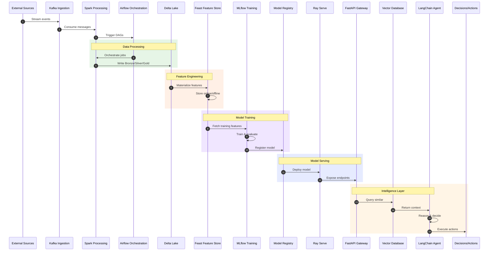

# Architecture Documentation

This document provides a comprehensive overview of the Autonomous Enterprise AI Decision System architecture, including layer descriptions, component responsibilities, and data flow patterns.

## System Overview

The system is designed as a modular, microservices-based architecture that enables real-time data processing, machine learning model training and serving, and autonomous AI-driven decision making.

## Architecture Layers

### 1. Data Ingestion Layer (Kafka)

**Technology**: Apache Kafka

**Responsibilities**:
- Real-time event streaming from multiple data sources
- Message durability and fault tolerance
- Decoupling of producers and consumers
- Partitioned, ordered event processing

**Key Components**:
- Kafka Brokers (clustered for HA)
- Schema Registry (Avro/Protobuf schemas)
- Kafka Connect (source/sink connectors)
- Topic management and partitioning

```
services/data-ingestion/
├── producers/           # Event producers
├── consumers/           # Event consumers
├── schemas/             # Schema definitions
└── connectors/          # Kafka Connect configs
```

---

### 2. Data Processing Layer (Spark + Airflow)

**Technologies**: Apache Spark, Apache Airflow

**Responsibilities**:
- Batch and stream processing of large datasets
- ETL/ELT pipeline orchestration
- Data quality validation and transformation
- Scheduled and event-driven workflows

**Key Components**:
- Spark Streaming jobs (micro-batch/continuous)
- Spark SQL for structured data processing
- Airflow DAGs for workflow orchestration
- Airflow Operators (Spark, Python, Docker)

```
services/data-processing/
├── spark_jobs/          # Spark applications
├── dags/                # Airflow DAG definitions
├── operators/           # Custom Airflow operators
└── transformations/     # Data transformation logic
```

---

### 3. Storage Layer (Delta Lake)

**Technology**: Delta Lake

**Responsibilities**:
- ACID-compliant data storage
- Time travel and versioning
- Schema enforcement and evolution
- Unified batch and streaming data

**Key Components**:
- Bronze layer (raw data)
- Silver layer (cleaned, validated)
- Gold layer (aggregated, business-ready)
- Metadata management

```
services/data-lake/
├── schemas/             # Table schemas
├── migrations/          # Schema migrations
├── compaction/          # Optimization jobs
└── retention/           # Data lifecycle policies
```

---

### 4. Feature Engineering Layer (Feast)

**Technology**: Feast

**Responsibilities**:
- Centralized feature definitions
- Feature serving for training and inference
- Point-in-time correct feature retrieval
- Feature monitoring and statistics

**Key Components**:
- Feature Store (offline/online)
- Feature Views (batch/stream)
- Entity definitions
- Feature Services

```
services/feature-store/
├── features/            # Feature definitions
├── entities/            # Entity definitions
├── data_sources/        # Data source configs
└── feature_services/    # Feature service definitions
```

---

### 5. ML Platform Layer (MLflow)

**Technology**: MLflow

**Responsibilities**:
- Experiment tracking and comparison
- Model versioning and registry
- Model packaging and deployment
- Artifact storage and management

**Key Components**:
- MLflow Tracking Server
- Model Registry
- MLflow Projects
- Model Signatures

```
services/ml-platform/
├── experiments/         # Experiment definitions
├── models/              # Model training code
├── pipelines/           # Training pipelines
└── registry/            # Model registry configs
```

---

### 6. Model Serving Layer (FastAPI + Ray Serve)

**Technologies**: FastAPI, Ray Serve

**Responsibilities**:
- Low-latency model inference
- Auto-scaling based on load
- A/B testing and canary deployments
- API gateway and request routing

**Key Components**:
- Ray Serve deployments
- FastAPI endpoints
- Load balancing
- Request batching

```
services/serving/
├── api/                 # FastAPI application
├── deployments/         # Ray Serve deployments
├── middleware/          # Request middleware
└── monitoring/          # Serving metrics
```

---

### 7. Vector Database Layer

**Technologies**: Pinecone, Milvus, or Chroma

**Responsibilities**:
- High-dimensional vector storage
- Similarity search at scale
- Embedding management
- Hybrid search (vector + metadata)

**Key Components**:
- Vector indexes
- Embedding pipelines
- Index management
- Query optimization

```
services/vector-db/
├── embeddings/          # Embedding generation
├── indexes/             # Index configurations
├── queries/             # Query templates
└── sync/                # Data synchronization
```

---

### 8. Agent Layer (LangChain)

**Technology**: LangChain

**Responsibilities**:
- Autonomous decision orchestration
- Tool usage and action execution
- Memory and context management
- Multi-step reasoning chains

**Key Components**:
- Agent definitions
- Tool integrations
- Memory stores
- Chain orchestration

```
services/agent/
├── agents/              # Agent definitions
├── tools/               # Tool implementations
├── chains/              # LangChain chains
├── prompts/             # Prompt templates
└── memory/              # Memory configurations
```

---

## Data Flow

### Complete Pipeline Sequence



### Data Flow Description

1. **Ingestion**: External sources (APIs, databases, IoT devices) stream events to Kafka topics
2. **Processing**: Spark Streaming consumes from Kafka, performs transformations
3. **Orchestration**: Airflow triggers and monitors Spark jobs, manages dependencies
4. **Storage**: Processed data lands in Delta Lake (Bronze → Silver → Gold)
5. **Features**: Feast materializes features from Delta Lake to online/offline stores
6. **Training**: MLflow fetches features from Feast, trains models, logs experiments
7. **Registry**: Trained models are registered with versioning and metadata
8. **Serving**: Ray Serve deploys models from registry, scales based on demand
9. **Gateway**: FastAPI provides REST endpoints, handles authentication
10. **Vector Search**: Relevant context retrieved via similarity search
11. **Agent**: LangChain agent orchestrates reasoning with tools and context
12. **Actions**: Final decisions executed (notifications, API calls, etc.)

---

## Infrastructure Considerations

### Scalability
- Horizontal scaling via Kubernetes
- Kafka partition scaling for throughput
- Ray autoscaling for inference
- Delta Lake optimization for query performance

### Reliability
- Multi-AZ deployments
- Kafka replication factor ≥ 3
- Circuit breakers and retries
- Health checks and self-healing

### Observability
- Distributed tracing (Jaeger/Zipkin)
- Metrics (Prometheus/Grafana)
- Centralized logging (ELK/Loki)
- Alerting and on-call rotation

### Security
- mTLS between services
- OAuth2/OIDC authentication
- RBAC for resource access
- Secrets management (Vault)
- Data encryption at rest and in transit

---

## Technology Versions

| Component | Version | Notes |
|-----------|---------|-------|
| Python | 3.11+ | Base runtime |
| Kafka | 3.6+ | Event streaming |
| Spark | 3.5+ | Data processing |
| Airflow | 2.8+ | Orchestration |
| Delta Lake | 3.0+ | Storage |
| Feast | 0.35+ | Feature store |
| MLflow | 2.10+ | ML platform |
| Ray | 2.9+ | Distributed compute |
| FastAPI | 0.109+ | API framework |
| LangChain | 0.1+ | Agent framework |

---

## Related Documentation

- [README.md](../README.md) - Project overview and quick start
- [infra/terraform/README.md](../infra/terraform/README.md) - Infrastructure setup
- [deploy/k8s/README.md](../deploy/k8s/README.md) - Kubernetes deployment
